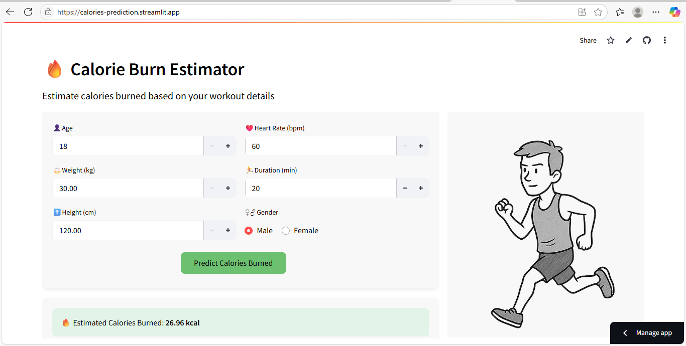

# Calorie Burn Predictor App

This Streamlit app estimates the number of calories a person might burn during physical activity based on inputs such as age, weight, heart rate, and duration. It uses an XGBoost regression model trained on real data.

## Project Overview

Understanding how many calories are burned during exercise is useful for fitness planning, weight loss, and health tracking. This project:
- Analyzes exercise-related physiological data
- Builds predictive models to estimate calorie expenditure
- Deploys an interactive web app for real-time predictions

## Try the App

🔗 **Live Demo**: [https://calories-prediction.streamlit.app](https://calories-prediction.streamlit.app)

## 🖼️ App Preview



## How It Works

### Input Features:
- Age
- Weight (kg)
- Height (cm)
- Gender (Male/Female)
- Heart Rate (bpm)
- Duration (min)

### Behind the Scenes:
- Preprocessing calculates features like `cardio_load` and `mass_ratio`
- Duration-based model switching:
  - **≤ 10 min** → low-duration model
  - **> 10 min** → high-duration model
- Models are trained with XGBoost and saved as `.json` files

## Folder Structure


## Folder Structure
- `app/` – Streamlit app files
- `artifacts/` – Saved XGBoost models
- `main.py` – App interface
- `load_predict.py` – Model loading & inference
- `requirements.txt` – Dependencies

## How to Run
```bash
cd app
streamlit run main.py
